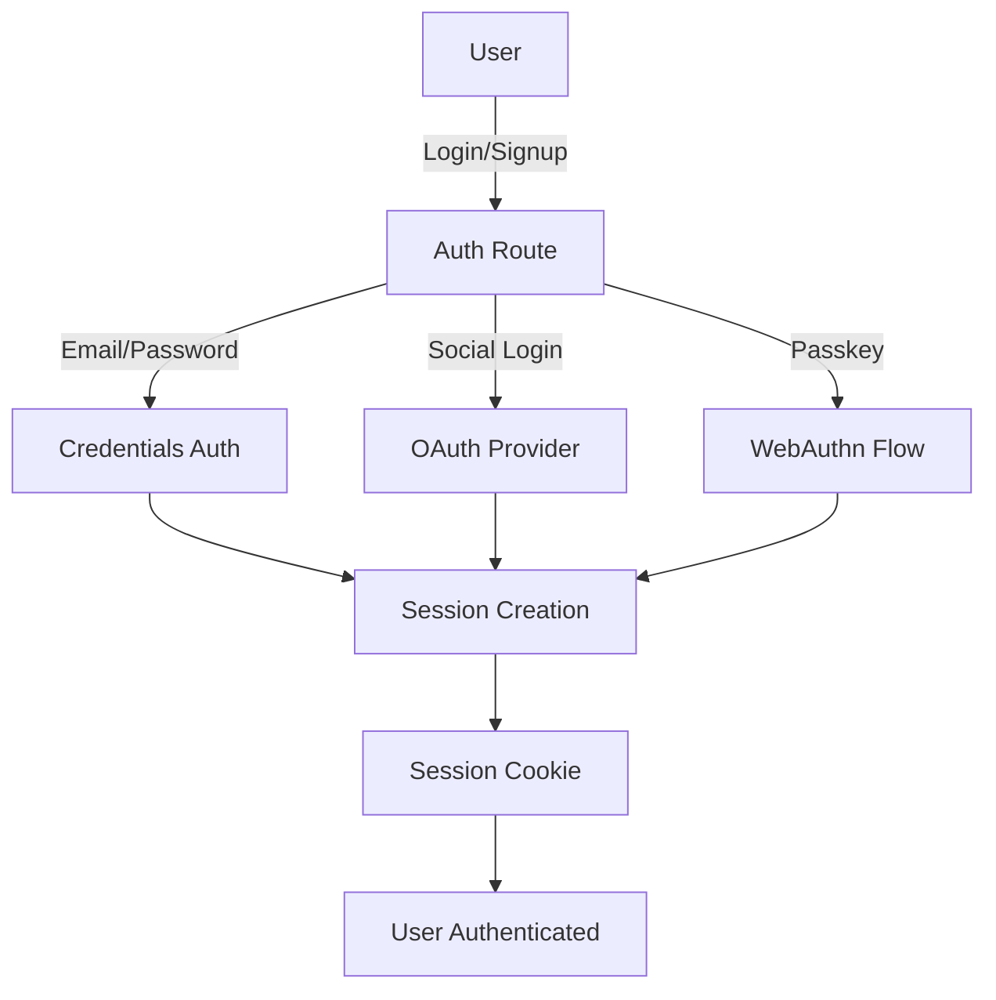
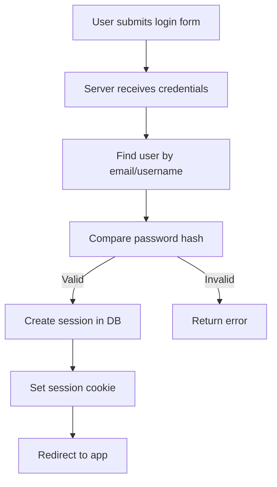

# Edulinks Authentication System Overview

## High-Level Architecture

Edulinks supports a modern, secure, and flexible authentication system with the following features:

- **Email/Password Authentication**
- **Social Login (OAuth) via Google, GitHub, Facebook, Twitter**
- **Passkey (WebAuthn) / Passwordless Authentication**
- **Session Management with Secure Cookies**
- **Two-Factor Authentication (2FA)**
- **Email Verification and Password Reset**

The system is modular, with clear separation between authentication logic, session management, user data, and provider integrations.

---

## Authentication Flows (High-Level)

---

## Detailed Breakdown

### 1. Email/Password Authentication
- **Signup**: User submits email, password, and optional referral. Password is hashed and user is created in the DB. Email verification is sent.
- **Login**: User submits email/username and password. Password is checked (bcrypt). If valid, a session is created and stored in the DB, and a session cookie is set.
- **Session**: Session is stored in the DB and referenced by a secure cookie (`en_session`).

**Key Files:**
- `app/utils/auth/auth.server.ts` (core logic)
- `app/routes/auth+/login.tsx`, `app/routes/auth+/signup.tsx` (routes)
- `app/utils/auth/session.server.ts` (session management)
- `app/utils/user/validations.ts` (validation)

### 2. Social Login (OAuth)
- **Providers**: Google, GitHub, Facebook, Twitter (see `app/utils/auth/providers/`)
- **Flow**: User clicks a social login button, is redirected to the provider, and on success, a connection is created or linked to a user. If new, onboarding is triggered.
- **Session**: Same as above, session is created and cookie is set.

**Key Files:**
- `app/routes/auth+/$provider+/callback.tsx` (handles callback)
- `app/utils/auth/connections/connection.server.ts` (provider logic)
- `app/utils/auth/providers/provider.ts` (provider interface)

### 3. Passkey (WebAuthn) Authentication
- **Registration**: User registers a passkey (FIDO2/WebAuthn) device. Challenge is generated and verified.
- **Login**: User authenticates with passkey. Challenge is generated, device signs it, server verifies, and session is created.

**Key Files:**
- `app/routes/auth+/webauthn+/registration.ts`, `authentication.ts` (WebAuthn logic)
- `app/routes/auth+/components/passkey.tsx` (UI)
- `app/utils/auth/passkey.server.ts` (DB logic)

### 4. Two-Factor Authentication (2FA)
- **Setup**: User can enable 2FA (TOTP, e.g., Google Authenticator). Verification codes are generated and validated.
- **Enforcement**: On login or sensitive actions, user is prompted for 2FA if enabled.

**Key Files:**
- `app/utils/auth/verification.server.tsx` (2FA, email verification, password reset)
- `app/utils/auth/session.server.ts` (2FA enforcement in session)

### 5. Email Verification & Password Reset
- **Verification**: On signup or email change, a code is sent to the user's email. User must verify before proceeding.
- **Password Reset**: User requests reset, receives code, and sets a new password.

**Key Files:**
- `app/utils/auth/verification.server.tsx`
- `app/routes/auth+/reset-password.tsx`

---

## Session Management
- Sessions are stored in the DB and referenced by a secure, HTTP-only cookie (`en_session`).
- Session expiration and renewal are handled automatically.
- Social and passkey logins also create sessions in the same way.

---

## How to Adapt for Another App (e.g., gadget-store)

1. **Session Management**: Use a secure cookie and DB-backed session store.
2. **Email/Password**: Hash passwords, validate on login, and create sessions.
3. **Social Login**: Integrate OAuth providers using a similar provider abstraction.
4. **Passkey/WebAuthn**: Use libraries like `@simplewebauthn/server` and `@simplewebauthn/browser` for passwordless auth.
5. **2FA/Verification**: Implement TOTP/email code verification for sensitive actions.
6. **Validation**: Use a schema validation library (like Zod) for all user input.

---

## Example: Email/Password Login Flow

---

## Key Concepts to Replicate
- **Separation of concerns**: Auth logic, session logic, and provider logic are modular.
- **Secure session cookies**: Always use HTTP-only, secure cookies for sessions.
- **Provider abstraction**: Social logins are pluggable via a provider interface.
- **Validation everywhere**: All user input is validated with clear error messages.
- **Extensible**: New auth methods (e.g., passkey) can be added without major rewrites.

---

## References
- `app/utils/auth/auth.server.ts`
- `app/utils/auth/session.server.ts`
- `app/utils/auth/connections/connection.server.ts`
- `app/utils/auth/providers/`
- `app/utils/auth/verification.server.tsx`
- `app/routes/auth+/`
- `app/utils/user/validations.ts`

---

*This document is a high-level and practical guide to understanding and replicating the Edulinks authentication system. For more details, see the referenced files and follow the flow diagrams above.* 